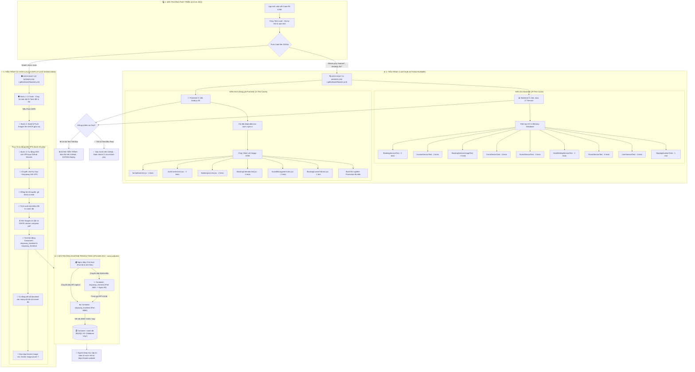

# 📖 TÀI LIỆU TOÀN DIỆN VỀ QUY TRÌNH CI/CD & DEPLOY DỰ ÁN STAYAWAY (STAYGO)

Tài liệu này tổng hợp toàn bộ sơ đồ kiến trúc, luồng hoạt động, cấu trúc tệp tin, bộ test cases và cơ chế tự động hóa CI/CD cho cả **Frontend (React)** và **Backend (Spring Boot)** của hệ thống StayAway.

---

## 🗺️ 1. Sơ Đồ Mermaid Quy Trình CI/CD Tổng Thể



---

## 📌 2. Nguyên Tắc Phân Nhánh & Triển Khai (Branching Strategy)

| Nhánh (Branch) | Hành động kích hoạt | Tiến trình thực thi | Tự động Deploy lên VPS? |
| :--- | :--- | :--- | :---: |
| **`feature/*`**, **`develop`**, **`fix/*`**, v.v. | `push` hoặc tạo `Pull Request` | Kích hoạt `ci.yml`: Chạy toàn bộ **43 bài test** & kiểm tra Build | ❌ **KHÔNG (Chỉ kiểm thử)** |
| **`main`** | `push` hoặc `merge` vào `main` | Kích hoạt `cd.yml`: Kiểm tra CI Gate $\rightarrow$ Nếu PASS 100% $\rightarrow$ **Tự động SSH & Deploy lên VPS** | ✅ **CÓ (Tự động 100%)** |

---

## 🧪 3. Danh Mục Toàn Bộ 43 Test Cases Đã Xây Dựng

### ☕ Backend: 8 Lớp Kiểm Thử (29 Test Cases - JUnit 5 + H2 In-Memory DB)
* **`BookingServiceTest.java`** (5 tests):
  1. Tạo đặt phòng mới với ngày hợp lệ và tính giá dự kiến chính xác.
  2. Bắt ngoại lệ `IllegalArgumentException` khi ngày trả phòng trước ngày nhận phòng.
  3. Gán phòng (`assignRoom`) chuyển trạng thái từ `NEW` $\rightarrow$ `CONFIRMED`.
  4. Hủy đặt phòng (`cancel`) chuyển trạng thái sang `CANCELLED`.
  5. Quy trình nhận phòng (`CHECK_IN`), chặn trả phòng khi chưa thanh toán hóa đơn, thanh toán và trả phòng (`CHECK_OUT`), chuyển phòng sang `DIRTY`.
* **`InvoiceServiceTest.java`** (2 tests):
  1. Lập hóa đơn chính thức khi khách đang ở phòng (`CHECKED_IN`).
  2. Ghi nhận thanh toán (`addPayment`) và tự động chuyển trạng thái hóa đơn sang `PAID`.
* **`BookingServiceUsageTest.java`** (3 tests):
  1. Thêm dịch vụ phụ thu (nước suối, giặt ủi) vào đặt phòng đang ở và tính toán tổng tiền.
  2. Lấy danh sách dịch vụ phụ thu đã dùng của booking.
  3. Xóa dịch vụ phụ thu khỏi đặt phòng.
* **`ExtraServiceTest.java`** (4 tests):
  1. Tạo dịch vụ phụ thu mới (thuê xe máy, giặt ủi, nước suối...).
  2. Lấy danh sách dịch vụ phụ thu đang mở bán công khai.
  3. Cập nhật đơn giá và thông tin dịch vụ phụ thu.
  4. Xóa/ngừng cung cấp dịch vụ phụ thu.
* **`GuestServiceTest.java`** (3 tests):
  1. Tạo thông tin hồ sơ khách hàng mới (CCCD, SĐT, Email).
  2. Tìm kiếm khách hàng theo từ khóa tên hoặc số điện thoại.
  3. Cập nhật thông tin liên hệ của khách hàng.
* **`HotelSettingServiceTest.java`** (2 tests):
  1. Lấy cấu hình thông tin khách sạn mặc định.
  2. Cập nhật tên cơ sở, địa chỉ và khung giờ nhận/trả phòng tiêu chuẩn (`14:00` / `12:00`).
* **`RoomServiceTest.java`** (5 tests):
  1. Tạo phòng mới với số phòng duy nhất.
  2. Bắt lỗi trùng lặp số phòng (`DuplicateResourceException`).
  3. Lấy danh sách tất cả các phòng.
  4. Dọn phòng chuyển trạng thái `DIRTY` $\rightarrow$ `AVAILABLE`.
  5. Khóa phòng bảo trì `MAINTENANCE`.
* **`UserServiceTest.java`** (4 tests):
  1. Đăng nhập thành công với tài khoản mặc định và cấp session token JWT.
  2. Bắt lỗi `UnauthorizedException` khi sai mật khẩu.
  3. Đăng ký nhân viên mới thành công.
  4. Bắt lỗi trùng tài khoản.
* **`StayApplicationTests.java`** (1 test): Kiểm tra nạp Spring Boot Context an toàn.

---

### ⚛️ Frontend: 6 Suite Kiểm Thử (14 Test Cases - Vitest + RTL + Happy-DOM)
* **`formatDate.test.js`** (4 tests):
  1. Định dạng ngày chuẩn `DD/MM/YYYY`.
  2. Định dạng thời gian `HH:mm • DD/MM/YYYY`.
  3. Định dạng giờ chuẩn nhận phòng (`14:00`) và trả phòng (`12:00`).
  4. Thuật toán tính số đêm lưu trú (`calculateNights`).
* **`AuthContext.test.jsx`** (3 tests):
  1. Cung cấp trạng thái khách (`GUEST`) ban đầu.
  2. Lưu trữ thông tin đăng nhập và phân quyền nhân viên.
  3. Xóa sạch phiên đăng nhập khi người dùng đăng xuất.
* **`BookingList.test.jsx`** (2 tests):
  1. Hiển thị trạng thái đang tải dữ liệu.
  2. Render danh sách đặt phòng với các nhãn Tiếng Việt (`Đang ở`, `Đã xác nhận`, `Đã đi`).
* **`BookingCalendar.test.jsx`** (2 tests):
  1. Render thanh công cụ, tiêu đề và bộ chọn khung ngày (7 ngày, 14 ngày, 21 ngày).
  2. Render bảng lịch phòng và bảng chú thích màu sắc Tiếng Việt.
* **`GuestManagement.test.jsx`** (2 tests):
  1. Render tiêu đề quản lý khách hàng và ô tìm kiếm nhanh.
  2. Render bảng danh sách khách hàng và dữ liệu khách hàng.
* **`BookingInvoiceTab.test.jsx`** (1 test):
  1. Render chi tiết hóa đơn, trạng thái `Đã thanh toán đủ`, nút `In Hóa Đơn` và lịch sử thanh toán.

---

## 📁 4. Danh Mục Toàn Bộ Tệp Tin Cấu Hình CI/CD Trong Dự Án

```
StayAway/
├── .github/
│   └── workflows/
│       ├── ci.yml                 # Workflow CI chạy kiểm thử 43 tests trên mọi nhánh phụ
│       └── cd.yml                 # Workflow CD chạy CI Gate & tự động Deploy lên VPS khi push vào main
├── Backend/
│   ├── Dockerfile                 # Đóng gói Backend Spring Boot (Maven Build + JRE 17 Alpine)
│   ├── .dockerignore              # Bỏ qua target/, .git, .idea khi đóng gói container
│   └── src/test/                  # Toàn bộ 29 Unit/Integration Tests Backend + H2 In-Memory DB config
├── Frontend/
│   ├── Dockerfile                 # Đóng gói Frontend React (Node 20 Build + Nginx Alpine)
│   ├── .dockerignore              # Bỏ qua node_modules, dist, .env khi đóng gói container
│   ├── nginx.conf                 # Cấu hình Web Server Nginx (Gzip, Cache, SPA Routing, API Proxy)
│   ├── vite.config.js             # Cấu hình Vite & môi trường test Happy-DOM
│   └── src/                       # Toàn bộ 14 Tests Frontend trong các thư mục __tests__/
├── docker-compose.yml             # Điều phối 2 container stayaway_backend và stayaway_frontend
├── DEPLOYMENT.md                  # Hướng dẫn chi tiết vận hành VPS
├── CICD_DOCUMENTATION.md          # Tài liệu tổng hợp kiến trúc & quy trình CI/CD (Tệp này)
└── .gitignore                     # Cấu hình bỏ qua tệp rác, node_modules, target
```

---

## 🔐 5. Danh Sách GitHub Secrets Cấu Hình

Hệ thống sử dụng 4 biến bí mật trong **GitHub Repository $\rightarrow$ Settings $\rightarrow$ Secrets and variables $\rightarrow$ Actions**:

1. `SERVER_HOST`: Địa chỉ IP của VPS (`13.236.183.211`).
2. `SERVER_USER`: Tên người dùng SSH (`ubuntu`).
3. `SSH_PRIVATE_KEY`: Khóa SSH bí mật (Private Key) dùng để kết nối vào VPS.
4. `VITE_API_BASE_URL_PROD`: URL API Production (`https://roomi.website/api/v1`).

---

## 🚀 6. Hướng Dẫn Vận Hành Hàng Ngày (Không Cần Vào VPS)

Khi có bất kỳ thay đổi code nào mới, lập trình viên chỉ cần thao tác tại máy cá nhân:

```bash
git add .
git commit -m "Cập nhật tính năng mới..."
git push origin main
```

**Toàn bộ quá trình kiểm thử, build, SSH vào VPS, pull code mới, tái khởi động container và dọn dẹp bộ nhớ sẽ được GitHub Actions thực thi tự động 100%!**
