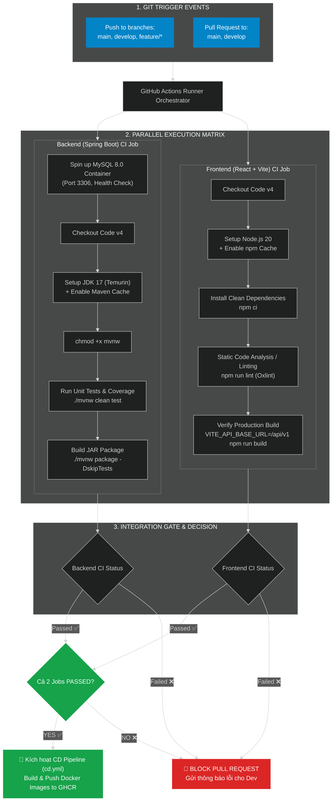
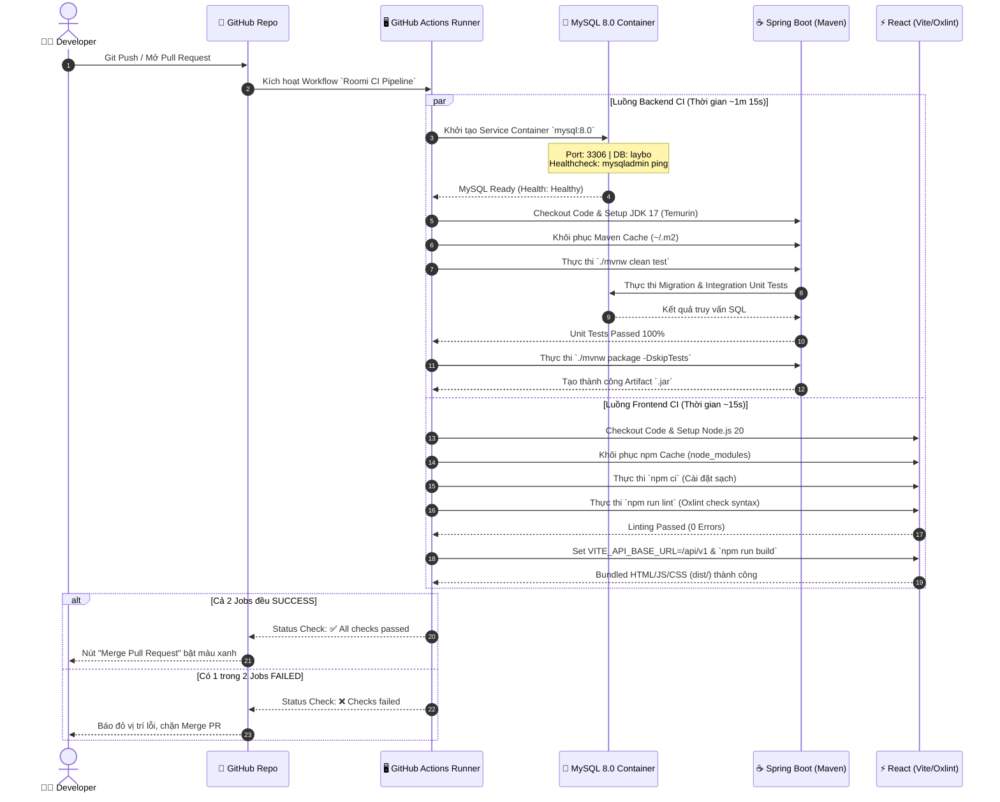

# 🚀 QUY TRÌNH CI (CONTINUOUS INTEGRATION) TOÀN BỘ FRONTEND VÀ BACKEND DỰ ÁN ROOMI

> **Tài liệu Quy trình Tự động hóa CI/CD**  
> Dự án: **Roomi System (Hệ thống Quản lý Khách sạn & Phòng nghỉ)**  
> Công nghệ: **Backend (Spring Boot 3, Java 17, MySQL 8.0)** | **Frontend (React 19, Vite 8, Oxlint)**  
> Công cụ CI/CD: **GitHub Actions**  
> Vị trí file workflow gốc: [`.github/workflows/ci.yml`](.github/workflows/ci.yml) & [`.github/workflows/cd.yml`](.github/workflows/cd.yml)

---

## 1. 🏗️ TỔNG QUAN KIẾN TRÚC CI PIPELINE

Quy trình CI của dự án Roomi được thiết kế theo mô hình **Parallel Job Execution (Chạy song song)** để tối ưu thời gian phản hồi cho lập trình viên. Ngay khi có hành động `push` hoặc tạo `Pull Request`, hệ thống GitHub Actions sẽ tự động kích hoạt 2 luồng kiểm thử độc lập cho **Backend** và **Frontend**.

---

## 2. 🔄 SƠ ĐỒ QUY TRÌNH CHI TIẾT THEO THỜI GIAN (SEQUENCE DIAGRAM)

Diagram dưới đây mô tả chính xác thứ tự thực hiện theo thời gian thực (Real-time Sequence) từ lúc Dev đẩy code tới khi CI phản hồi kết quả:

---

## 3. 📋 BẢNG PHÂN TÍCH CHI TIẾT TỪNG BƯỚC THỰC THI (STEP-BY-STEP BREAKDOWN)

### ☕ 3.1 Backend (Spring Boot) CI Job Specs

|  STT  | Tên Bước (Step Name)          | Lệnh / Action                | Mục đích                                                           | Điều kiện Đạt (Success Criteria)                                |
| :---: | :---------------------------- | :--------------------------- | :----------------------------------------------------------------- | :-------------------------------------------------------------- |
| **1** | **Service Setup**             | `mysql:8.0` container        | Giả lập cơ sở dữ liệu MySQL thật cho Integration Test.             | Container chạy thành công ở port `3306`, DB `laybo` sẵn sàng.   |
| **2** | **Checkout Code**             | `actions/checkout@v4`        | Tải mã nguồn mới nhất từ commit về Runner environment.             | Mã nguồn nằm trong `./Backend/roomi`.                           |
| **3** | **Set up JDK 17**             | `actions/setup-java@v4`      | Thiết lập môi trường Java 17 Temurin & kích hoạt Maven caching.    | `java -version` ra 17.x, tái sử dụng các file `.m2` dependency. |
| **4** | **Make mvnw Executable**      | `chmod +x mvnw`              | Đảm bảo script Maven Wrapper có đủ quyền thực thi trên Linux.      | File `mvnw` có thuộc tính `+x`.                                 |
| **5** | **Run Unit Tests & Coverage** | `./mvnw clean test`          | Chạy toàn bộ các bài unit test & integration test của Spring Boot. | `BUILD SUCCESS`, 0 test bị fail hay error.                      |
| **6** | **Build Backend Package**     | `./mvnw package -DskipTests` | Kiểm tra khả năng đóng gói ứng dụng thành file `.jar` hoàn chỉnh.  | Sinh ra file target `roomi-0.0.1-SNAPSHOT.jar`.                 |

---

### ⚡ 3.2 Frontend (React + Vite) CI Job Specs

|  STT  | Tên Bước (Step Name)      | Lệnh / Action                                 | Mục đích                                                                     | Điều kiện Đạt (Success Criteria)                      |
| :---: | :------------------------ | :-------------------------------------------- | :--------------------------------------------------------------------------- | :---------------------------------------------------- |
| **1** | **Checkout Code**         | `actions/checkout@v4`                         | Tải mã nguồn React về Runner environment.                                    | Mã nguồn nằm trong `./Frontend/roomi`.                |
| **2** | **Set up Node.js 20**     | `actions/setup-node@v4`                       | Cài đặt Node.js v20 LTS và kích hoạt npm cache dựa theo `package-lock.json`. | Node.js v20.x sẵn sàng, khôi phục cache node_modules. |
| **3** | **Install Dependencies**  | `npm ci`                                      | Cài chuẩn xác các package ghi trong `package-lock.json`.                     | Thư mục `node_modules` được khởi tạo chuẩn xác.       |
| **4** | **Run Oxlint**            | `npm run lint`                                | Kiểm tra lỗi cú pháp, linter, formatting bằng Oxlint siêu nhanh.             | Không có syntax error hoặc unreachable code.          |
| **5** | **Build Frontend Verify** | `env VITE_API_BASE_URL=/api/v1 npm run build` | Thử nghiệm biên dịch toàn bộ JSX/JS/CSS ra sản phẩm tĩnh (Production build). | Sinh ra thư mục `dist/` với bundle hoàn chỉnh.        |

---

## 4. 🧪 BỘ TEST CASE CI (CI TEST CASE MATRIX)

### 🅰️ Bảng Test Cases Backend CI

| Mã TC        | Tên Test Case                | Input / Trigger          | Các bước thực hiện                                                 | Kết quả mong đợi                                       |
| :----------- | :--------------------------- | :----------------------- | :----------------------------------------------------------------- | :----------------------------------------------------- |
| **TC-BE-01** | Test MySQL Service Container | Push branch `develop`    | 1. Runner tạo container `mysql:8.0` 2. Ping port 3306 trong 30s | MySQL container ping trả về 0 (healthy).               |
| **TC-BE-02** | Test Setup Java 17 & Cache   | Event Push/PR            | 1. Cài JDK 17 Temurin 2. Load Maven cache                       | Maven khôi phục thư viện từ cache, tiết kiệm 70% time. |
| **TC-BE-03** | Test Quyền thực thi `mvnw`   | Executable permissions   | 1. Chạy `chmod +x mvnw` 2. Exec `./mvnw -v`                     | Lệnh chạy bình thường, không báo Permission Denied.    |
| **TC-BE-04** | Test Chạy Unit Tests         | Lệnh `./mvnw clean test` | 1. Kết nối DB MySQL 2. Chạy SpringBoot Test suite               | 100% tests Passed, không báo lỗi connection pool.      |
| **TC-BE-05** | Test Đóng gói JAR            | Lệnh `./mvnw package`    | 1. Compile Java bytecodes 2. Đóng gói Fat JAR                   | File `.jar` được khởi tạo thành công trong `target/`.  |
| **TC-BE-06** | Handle Test Failure          | Code có 1 test fail      | 1. Push code chứa test sai 2. CI trigger                        | Job Backend dừng ở step test, báo màu ĐỎ ❌.           |

### 🅱️ Bảng Test Cases Frontend CI

| Mã TC        | Tên Test Case               | Input / Trigger         | Các bước thực hiện                                             | Kết quả mong đợi                                   |
| :----------- | :-------------------------- | :---------------------- | :------------------------------------------------------------- | :------------------------------------------------- |
| **TC-FE-01** | Test Setup Node 20 & Cache  | Event Push/PR           | 1. Setup Node 20 2. Point cache to `package-lock.json`      | Node 20 active, khôi phục `~/.npm` cache.          |
| **TC-FE-02** | Test `npm ci` Clean Install | Lockfile có sẵn         | 1. Exec `npm ci`                                               | Cài đặt chính xác phiên bản các thư viện.          |
| **TC-FE-03** | Test Oxlint Static Analysis | Code JS/JSX             | 1. Exec `npm run lint`                                         | Oxlint quét code dưới 1 giây, báo 0 error.         |
| **TC-FE-04** | Test Production Build Vite  | Env `VITE_API_BASE_URL` | 1. Set env path tương đối `/api/v1` 2. Exec `npm run build` | Biên dịch thành công thư mục `dist/`.              |
| **TC-FE-05** | Handle Syntax Failure       | Push code sai cú pháp   | 1. Push code thiếu dấu đóng ngoặc 2. CI trigger             | Oxlint/Vite bắt được lỗi, dừng pipeline báo ĐỎ ❌. |

### 🆂 Bảng Test Cases Tích Hợp & Gate Checks

| Mã TC         | Tên Test Case               | Input / Trigger                     | Các bước thực hiện                               | Kết quả mong đợi                                         |
| :------------ | :-------------------------- | :---------------------------------- | :----------------------------------------------- | :------------------------------------------------------- |
| **TC-INT-01** | Trigger trên đúng Branch    | Push `main`, `develop`, `feature/*` | 1. Push code tới branch quy định                 | Workflow `Roomi CI Pipeline` tự động chạy.               |
| **TC-INT-02** | Run Parallel 2 Jobs         | Trigger Event                       | 1. Quan sát log runner                           | `backend-ci` và `frontend-ci` bắt đầu cùng lúc.          |
| **TC-INT-03** | Gate Chặn CD khi CI Lỗi     | Push `main` với code lỗi            | 1. BE hoặc FE CI bị FAILED 2. Kiểm tra job CD | CD Workflow `cd.yml` bị BLOCK, không build Docker Image. |
| **TC-INT-04** | Protection Rule trên GitHub | PR có CI bị FAILED                  | 1. Mở PR vào `main` 2. Kiểm tra nút Merge     | Nút "Merge Pull Request" bị VÔ HIỆU HÓA.                 |

---

## 5. 🛠️ HƯỚNG DẪN XỬ LÝ SỰ CỐ (TROUBLESHOOTING GUIDE)

1. **Lỗi `Permission denied: ./mvnw`**:
   - **Nguyên nhân**: File `mvnw` chưa được gắn quyền executable trong Git repository.
   - **Fix**: Chạy `git update-index --chmod=+x Backend/roomi/mvnw` rồi commit lại.
2. **Lỗi `Communications link failure` ở Backend**:
   - **Nguyên nhân**: MySQL container chưa kịp sẵn sàng khi Spring Boot chạy test.
   - **Fix**: Kiểm tra phần `options: --health-cmd="mysqladmin ping"` trong `ci.yml`.
3. **Lỗi `Node.js 20 is deprecated` Warning**:
   - **Nguyên nhân**: Thông báo nhắc nhở từ GitHub Actions runner về kế hoạch nâng cấp Node runtime.
   - **Fix**: Các action `actions/checkout@v4` và `actions/setup-node@v4` đã ở bản mới nhất, warning này không ảnh hưởng đến build result.
4. **Lỗi `Oxlint` phát hiện unused variable**:
   - **Nguyên nhân**: Khai báo biến trong React nhưng không sử dụng.
   - **Fix**: Xóa biến thừa hoặc thêm comment ngoại lệ theo chuẩn Oxlint trước khi push.
