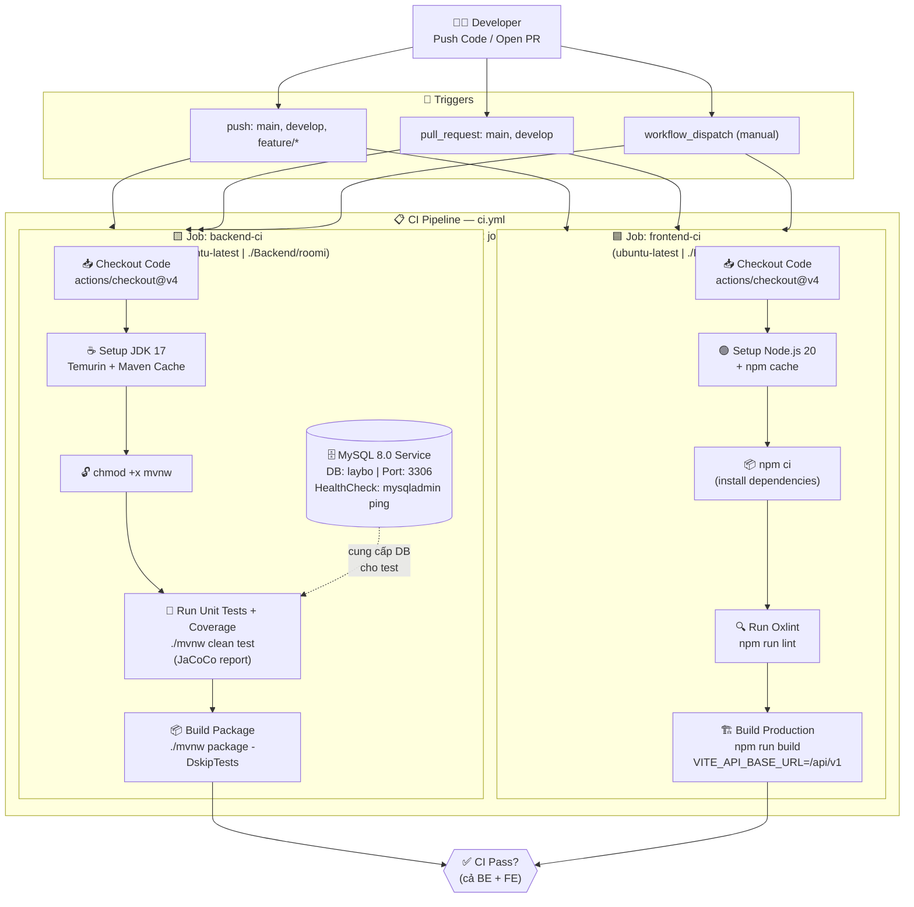
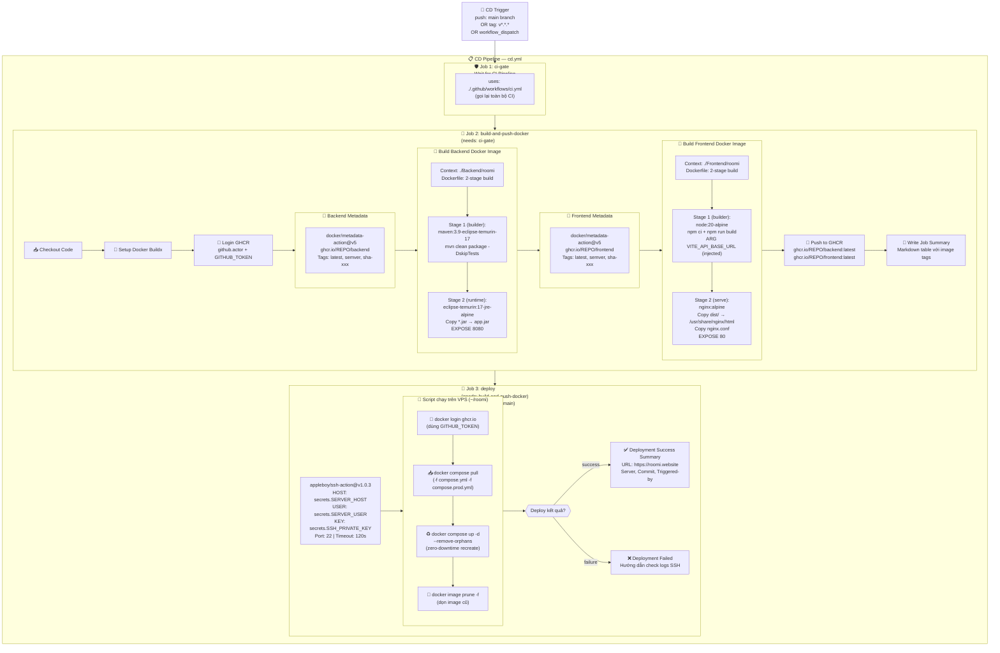
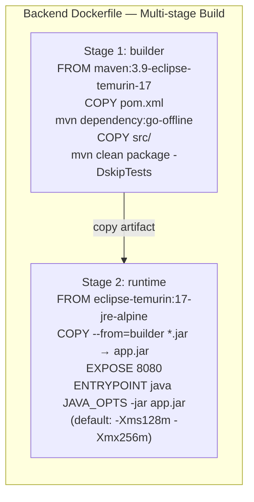
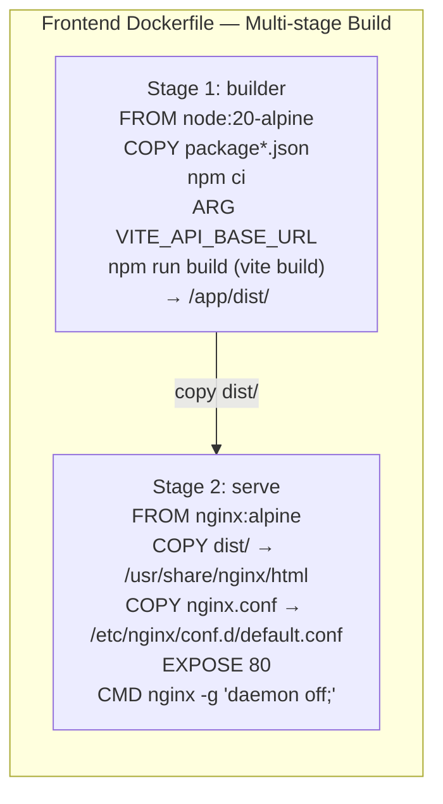
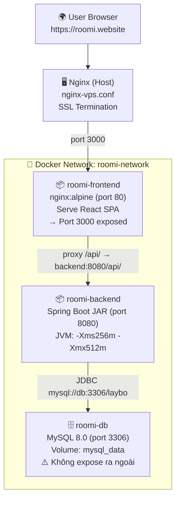

# 🚀 Roomi CI/CD Pipeline — Toàn Bộ Quy Trình

> Tài liệu này mô tả toàn bộ quy trình CI (Continuous Integration) và CD (Continuous Deployment) của dự án **Roomi** bao gồm cả Frontend (React + Vite) và Backend (Spring Boot).

---

## 📁 Cấu Trúc Liên Quan

| File | Vai Trò |
|------|---------|
| [ci.yml](file:///d:/fn-roomi/roomi/.github/workflows/ci.yml) | CI Pipeline — kiểm tra chất lượng code |
| [cd.yml](file:///d:/fn-roomi/roomi/.github/workflows/cd.yml) | CD Pipeline — build Docker & deploy lên VPS |
| [Backend/roomi/Dockerfile](file:///d:/fn-roomi/roomi/Backend/roomi/Dockerfile) | Multi-stage Docker build cho Spring Boot |
| [Frontend/roomi/Dockerfile](file:///d:/fn-roomi/roomi/Frontend/roomi/Dockerfile) | Multi-stage Docker build cho React + Nginx |
| [docker-compose.yml](file:///d:/fn-roomi/roomi/docker-compose.yml) | Base compose (dev/local) |
| [docker-compose.prod.yml](file:///d:/fn-roomi/roomi/docker-compose.prod.yml) | Production override — dùng ảnh từ GHCR |
| [Frontend/roomi/nginx.conf](file:///d:/fn-roomi/roomi/Frontend/roomi/nginx.conf) | Nginx proxy API → Backend |

---

## 🔷 Sơ Đồ Toàn Bộ CI/CD Pipeline

---

## 🔶 Sơ Đồ CD Pipeline (Chỉ Khi Push → main hoặc Tag v*.*.*)

---

## 🏗️ Chi Tiết Dockerfile — Backend (Spring Boot)

> **Stack BE:** Spring Boot 4.1.0 · JPA · WebMVC · MySQL · PostgreSQL · Lombok · Validation · JaCoCo · Apache POI

---

## 🏗️ Chi Tiết Dockerfile — Frontend (React + Vite → Nginx)

> **Stack FE:** React 19 · Vite 8 · React Router 7 · Axios · Lucide-React · Oxlint

---

## 🌐 Kiến Trúc Runtime Trên VPS

---

## 📊 Tóm Tắt Luồng Theo Branch

| Branch / Event | CI chạy? | CD chạy? | Deploy? |
|---|---|---|---|
| `push feature/*` | ✅ BE + FE | ❌ | ❌ |
| `push develop` | ✅ BE + FE | ❌ | ❌ |
| `PR → main` | ✅ BE + FE | ❌ | ❌ |
| `PR → develop` | ✅ BE + FE | ❌ | ❌ |
| `push main` | ✅ (qua ci-gate) | ✅ Build & Push | ✅ Deploy VPS |
| `push tag v*.*.*` | ✅ (qua ci-gate) | ✅ Build & Push | ❌ (chỉ main) |
| `workflow_dispatch` | ✅ | ✅ (CD) | ✅ (nếu main) |

---

## 🔐 GitHub Secrets Cần Thiết

| Secret | Dùng Ở | Mô Tả |
|--------|--------|-------|
| `GITHUB_TOKEN` | CD (tự động) | Đăng nhập GHCR, push images |
| `SERVER_HOST` | Deploy job | IP hoặc domain VPS |
| `SERVER_USER` | Deploy job | SSH user (thường: `ubuntu`) |
| `SSH_PRIVATE_KEY` | Deploy job | Nội dung file `.pem` của EC2 |
| `VITE_API_BASE_URL_PROD` | Docker build FE | URL API production (fallback: `/api/v1`) |
| `DB_PASSWORD` | `.env` trên VPS | Mật khẩu MySQL production |
| `DB_USERNAME` | `.env` trên VPS | Username MySQL production |
