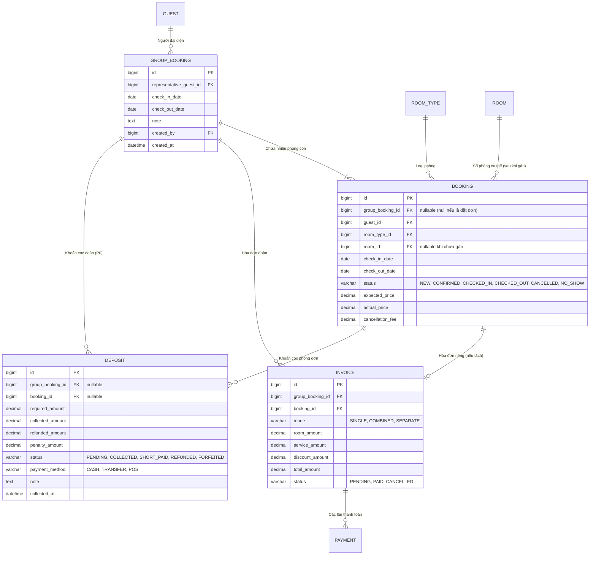
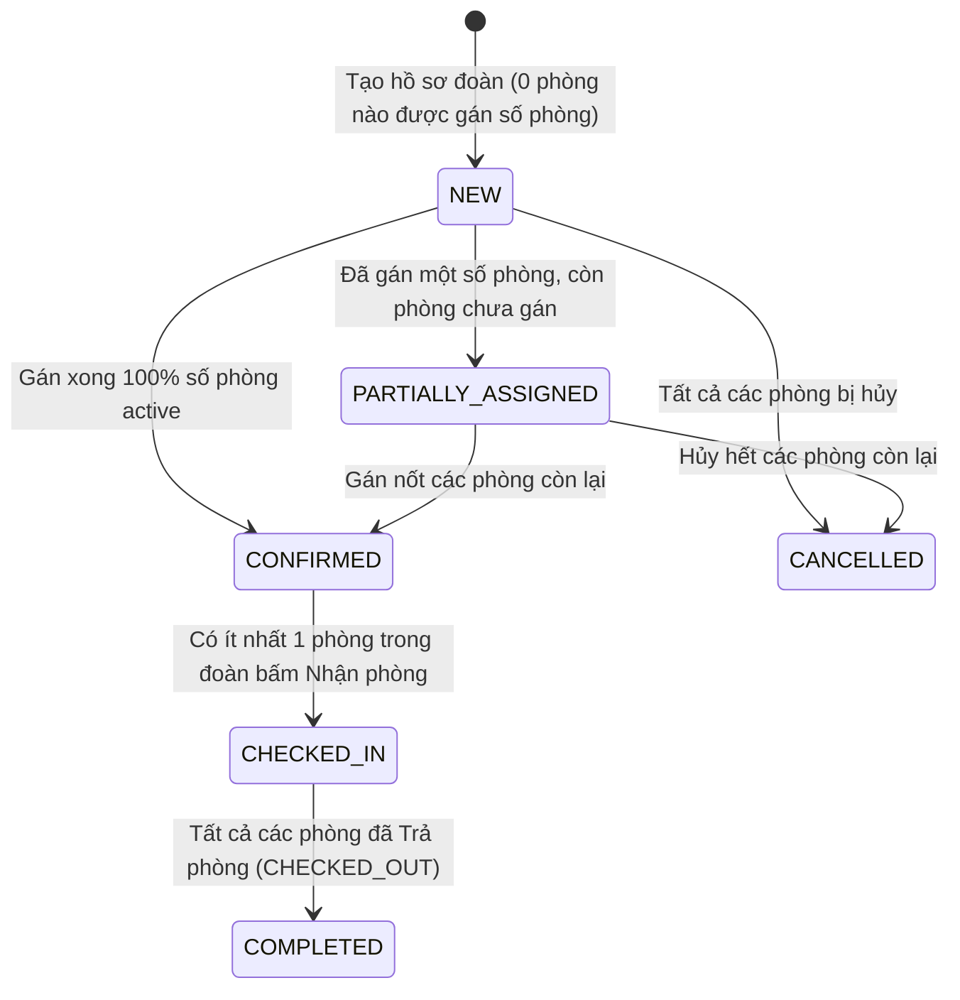
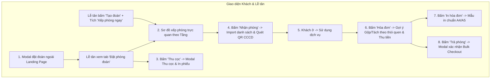

# TÀI LIỆU CHI TIẾT NGHIỆP VỤ & LUỒNG FRONTEND: ĐẶT PHÒNG THEO ĐOÀN (GROUP BOOKING - EPIC NCL-13)

Tài liệu này tổng hợp toàn bộ **quy tắc nghiệp vụ (Business Rules)**, **mô hình dữ liệu (Data Model)**, **luồng xử lý Backend (APIs)** và **luồng giao diện Frontend (UI/UX)** của tính năng Đặt phòng theo đoàn trong hệ thống quản lý khách sạn Roomi / StayGO.

---

## MỤC LỤC

1. [Tổng quan & Mục tiêu nghiệp vụ](#1-tổng-quan--mục-tiêu-nghiệp-vụ)
2. [Mô hình dữ liệu & Quan hệ thực thể](#2-mô-hình-dữ-liệu--quan-hệ-thực-thể)
3. [Vòng đời & Máy trạng thái hồ sơ đoàn (State Machine)](#3-vòng-đời--máy-trạng-thái-hồ-sơ-đoàn-state-machine)
4. [Quy tắc nghiệp vụ cốt lõi (Business Rules)](#4-quy-tắc-nghiệp-vụ-cốt-lõi-business-rules)
5. [Luồng Frontend chi tiết từng bước (Step-by-Step UI/UX)](#5-luồng-frontend-chi-tiết-từng-bước-step-by-step-uiux)
   - 5.1. Bước 1: Khách đặt đoàn từ Cổng công khai (Public Landing Modal)
   - 5.2. Bước 2: Lễ tân tạo hồ sơ đoàn tại quầy & Tùy chọn Xếp phòng ngay (P1.1)
   - 5.3. Bước 3: Thu tiền đặt cọc cho đoàn (P0 - Group Deposit)
   - 5.4. Bước 4: Sơ đồ xếp phòng trực quan theo Tầng (P1.2 - Floor-based Grid)
   - 5.5. Bước 5: Nhập danh sách khách & Nhận phòng đoàn (P1.3 - Bulk Check-in & CCCD Matching)
   - 5.6. Bước 6: Hủy một phần số phòng & Preview phí phạt real-time (P1.4 - Real-time Cancel Fee)
   - 5.7. Bước 7: Lập hóa đơn đoàn có ghi nhớ thói quen khách đại diện (P1.5 - Mode Memory)
   - 5.8. Bước 8: Quyết toán & In hóa đơn đoàn chuẩn khổ A4
   - 5.9. Bước 9: Trả phòng đoàn đồng loạt (Bulk Check-out)
6. [Danh mục API Backend liên quan](#6-danh-mục-api-backend-liên-quan)
7. [Các trường hợp biên & Xử lý ngoại lệ (Edge Cases)](#7-các-trường-hợp-biên--xử-lý-ngoại-lệ-edge-cases)

---

## 1. TỔNG QUAN & MỤC TIÊU NGHIỆP VỤ

### Vấn đề thực tế tại khách sạn:
- Khi có một đoàn khách (công ty, tour du lịch, gia đình lớn) từ 3 đến hàng chục phòng, nếu lễ tân phải tạo từng booking đơn lẻ, gán từng phòng, nhận phòng từng phòng và tính tiền từng phòng thì mất từ 30 đến 60 phút, rất dễ nhầm lẫn thông tin và trùng phòng.
- Khi thanh toán, một số đoàn yêu cầu xuất **1 hóa đơn chung** cho toàn bộ công ty thanh toán, một số đoàn yêu cầu **tách riêng từng phòng** cho các cá nhân tự thanh toán.
- Khi sát ngày đến, đoàn có thể **giảm bớt số lượng phòng** (ví dụ đặt 10 phòng nhưng chỉ đi 8 phòng).
- Đoàn cần được thu tiền đặt cọc tập trung để giữ chỗ và cấn trừ tự động khi thanh toán.

### Giải pháp hệ thống (Chuẩn KiotViet - Thao tác cực nhanh tại quầy):
- Cung cấp **Hồ sơ đặt phòng đoàn (`GroupBooking`)** quản lý tập trung nhiều phòng con (`Booking`).
- **Thu cọc đoàn tập trung (P0)**: Ghi nhận các khoản cọc trực tiếp trên hồ sơ đoàn, cảnh báo sát ngày chưa cọc, tự động cấn trừ khi thanh toán hóa đơn gộp.
- **Xếp phòng ngay (P1.1)**: Tích chọn "Xếp phòng ngay" mở thẳng sơ đồ gán phòng không qua nhiều bước trung gian.
- **Sơ đồ phòng trực quan theo tầng (P1.2)**: Giao diện lưới phòng trực quan thay cho dropdown (🟩 Trống, 🟨 Gợi ý/Đang chọn, ⬜ Không khả dụng).
- **Import danh sách khách (P1.3)**: Paste hoặc tải file CSV/Excel danh sách khách; quét QR CCCD đối chiếu tự động (tích xanh khi khớp, cảnh báo đỏ khi lệch).
- **Tính phí hủy real-time (P1.4)**: Xem trước phí phạt hủy ngay khi tick chọn phòng trong modal hủy một phần.
- **Ghi nhớ hóa đơn theo khách đại diện (P1.5)**: Tự động pre-select chế độ hóa đơn gộp/tách mà khách từng dùng.
- **Thanh tiến độ & Badges trực quan (P1.6)**: Progress bar `x/N đã xếp`, badge trạng thái cọc và hóa đơn.

---

## 2. MÔ HÌNH DỮ LIỆU & QUAN HỆ THỰC THỂ

---

## 3. VÒNG ĐỜI & MÁY TRẠNG THÁI HỒ SƠ ĐOÀN (STATE MACHINE)

Trạng thái của hồ sơ đoàn được suy diễn động từ trạng thái của các `Booking` con:

| Trạng thái | Điều kiện suy diễn | Cờ đặt cọc (`depositPaid`) | Ý nghĩa nghiệp vụ | Các nút thao tác hiển thị |
| :--- | :--- | :---: | :--- | :--- |
| **`NEW`** | Chưa có phòng nào gán `roomId` | Có thể cọc / chưa cọc | Đoàn mới tạo, cần xếp phòng & thu cọc | `Thu cọc`, `Gán phòng`, `Hủy bớt`, `Hóa đơn` |
| **`PARTIALLY_ASSIGNED`** | Số phòng đã gán $> 0$ và $<$ tổng phòng active | Có thể cọc / chưa cọc | Đã gán một số phòng | `Thu cọc`, `Gán phòng`, `Nhận phòng` (cho phòng đã gán), `Hủy bớt`, `Hóa đơn` |
| **`CONFIRMED`** | 100% phòng active đã có `roomId` | Có thể cọc / chưa cọc | Sẵn sàng đón khách | `Thu cọc`, `Nhận phòng` (Bulk Check-in), `Hủy bớt`, `Hóa đơn` |
| **`CHECKED_IN`** | Có ít nhất 1 phòng `CHECKED_IN` | Đã cọc / Đang thanh toán | Khách đoàn đang lưu trú | `Trả phòng` (Bulk Check-out), `Hóa đơn` |
| **`COMPLETED`** | 100% phòng đã `CHECKED_OUT` hoặc `CANCELLED` | Đã quyết toán xong | Đoàn đã trả phòng & hoàn tất | `Hóa đơn` (Xem/In lại) |
| **`CANCELLED`** | Toàn bộ phòng trong đoàn bị hủy | Đã xử lý hủy/hoàn cọc | Đoàn đã hủy | `Xem chi tiết` |

---

## 4. QUY TẮC NGHIỆP VỤ CỐT LÕI (BUSINESS RULES)

### 📌 Quy tắc 1: Kiểm tra sức chứa khi tạo đoàn (Capacity Check)
- Khi tạo đoàn yêu cầu $N$ phòng loại A trong khoảng $[D_{in}, D_{out}]$:
  $$\text{Số phòng khả dụng} = \text{Tổng số phòng loại A} - \text{Số phòng loại A đã có đặt phòng chồng lấn}$$
- Nếu $N > \text{Số phòng khả dụng}$ $\rightarrow$ **Chặn tạo đoàn**, thông báo rõ loại phòng chỉ còn $X$ phòng trống.

### 📌 Quy tắc 2: Toàn vẹn khi gán phòng hàng loạt (QTN-25)
- Thao tác gán phòng cho cả đoàn phải **thành công trọn vẹn (Atomic)** hoặc **hoàn tác toàn bộ (Rollback)**.
- Áp dụng khóa bi quan (`SELECT ... FOR UPDATE`) trên danh sách các phòng được chọn.
- Nếu có bất kỳ phòng nào bị chiếm bởi phiên làm việc khác $\rightarrow$ Rollback toàn bộ, giữ nguyên trạng thái cũ, báo lỗi phòng xung đột.

### 📌 Quy tắc 3: Thu và cấn trừ tiền đặt cọc đoàn (P0 / QTN-18)
- Tiền cọc đoàn có thể thu vào bất kỳ thời điểm nào sau khi tạo hồ sơ đoàn (`NEW`, `PARTIALLY_ASSIGNED`, `CONFIRMED`).
- Không bắt buộc phải cọc mới được gán phòng; tuy nhiên nếu ngày nhận phòng cách $\le 2$ ngày mà chưa cọc, hệ thống hiển thị badge cảnh báo màu đỏ nhấp nháy `Sát ngày chưa cọc`.
- Khi thanh toán hóa đơn gộp (`COMBINED`), toàn bộ các khoản cọc của đoàn sẽ được **tự động cấn trừ vào hóa đơn**.

### 📌 Quy tắc 4: Quy tắc hủy một phần số phòng trong đoàn (NCL-13-CN-004)
- **Không được chọn hủy hết 100% số phòng** qua chức năng này (nếu muốn hủy hết phải dùng chức năng hủy cả đoàn).
- Chỉ được hủy các phòng chưa nhận phòng (`NEW` hoặc `CONFIRMED`). Phòng đã `CHECKED_IN` không được hủy từng phần.
- **Tính phí hủy & Preview real-time**:
  - Hủy trước thời hạn miễn phí: Phí hủy = 0đ.
  - Hủy quá thời hạn miễn phí: Phí phạt = `penaltyPercent% * giá phòng`.
- Giải phóng phòng bị hủy trở lại `AVAILABLE`, cập nhật lại tổng tiền đoàn.

### 📌 Quy tắc 5: Tách hoặc Gộp hóa đơn đoàn (NCL-13-CN-003)
- Chỉ được tạo hóa đơn khi đoàn ở trạng thái `CHECKED_IN` hoặc chuẩn bị trả phòng.
- **Chế độ gộp (`COMBINED`)**: 1 hóa đơn chung, trừ cọc đoàn tự động.
- **Chế độ tách (`SEPARATE`)**: $N$ hóa đơn riêng lẻ tương ứng cho $N$ booking con.
- **Ghi nhớ thói quen (P1.5)**: Tự động pre-select chế độ mà người đại diện đoàn đã sử dụng ở lần lưu trú trước đó gần nhất.

### 📌 Quy tắc 6: Trả phòng đoàn đồng loạt (Bulk Check-out)
- Điều kiện: Toàn bộ phòng muốn checkout phải đang ở trạng thái `CHECKED_IN` và hóa đơn đoàn (hoặc hóa đơn riêng) phải ở trạng thái `PAID`.
- Khi thực hiện: Toàn bộ phòng chuyển sang `CHECKED_OUT`, trạng thái vật lý của tất cả các phòng chuyển sang `DIRTY` (Cần dọn).

---

## 5. LUỒNG FRONTEND CHI TIẾT TỪNG BƯỚC (STEP-BY-STEP UI/UX)

### 5.1. Bước 1: Khách đặt đoàn từ Cổng công khai (`PublicGroupBookingModal.jsx`)
- Khách chọn ngày, số lượng phòng theo từng loại, điền họ tên, CCCD, SĐT người đại diện.

### 5.2. Bước 2: Lễ tân tạo hồ sơ đoàn tại quầy & Xếp phòng ngay (`GroupBookingForm.jsx` - P1.1)
- Lễ tân bấm **+ Tạo đoàn mới**, điền thông tin và nhu cầu phòng.
- Có tùy chọn checkbox: `[x] Mở ngay sơ đồ xếp phòng sau khi tạo hồ sơ đoàn`.
- Khi submit thành công, hệ thống tự động nhảy thẳng sang mở modal sơ đồ phòng.

### 5.3. Bước 3: Thu tiền đặt cọc đoàn (`GroupDepositModal.jsx` - P0)
- Bấm nút **Thu cọc** trên dòng đoàn.
- Modal hiển thị tóm tắt mức cọc yêu cầu (30%), đã thu, còn thiếu.
- Các nút chọn nhanh số tiền: `30%`, `50%`, `100%`.
- Chọn phương thức: Chuyển khoản VietQR / Tiền mặt / Thẻ POS.
- Bấm **Xác nhận Thu cọc** $\rightarrow$ Cập nhật badge `Đã cọc xxx đ`.

### 5.4. Bước 4: Sơ đồ xếp phòng trực quan theo Tầng (`GroupRoomAssignmentGrid.jsx` - P1.2)
- Thay thế hoàn toàn dropdown bằng sơ đồ lưới phòng trực quan:
  - Cột trái: Danh sách phòng cần xếp của đoàn.
  - Cột phải: Lưới phòng gom theo từng tầng (Tầng 1, Tầng 2, Tầng 3).
  - Màu sắc:
    - 🟩 **Xanh lá**: Phòng trống khả dụng.
    - 🟨 **Vàng viền đậm**: Phòng đang chọn / Gợi ý của hệ thống.
    - ⬜ **Xám**: Không khả dụng hoặc khác loại phòng.
- Bấm **Áp dụng gợi ý tối ưu của hệ thống** để tự động điền các phòng liền kề trong 1 cú click.

### 5.5. Bước 5: Nhập danh sách khách & Nhận phòng đoàn (`BulkCheckInModal.jsx` - P1.3)
- Bấm nút **Nhận phòng** trên dòng đoàn:
- Nút **Nhập danh sách (CSV / Excel)**: Cho phép dán văn bản hoặc copy từ Excel (`Số phòng, Họ tên, CCCD, SĐT`) $\rightarrow$ Hệ thống tự động phân bổ vào từng phòng.
- **Quét QR CCCD đối chiếu**:
  - Dùng máy quét bắn QR trên thẻ CCCD của khách $\rightarrow$ Nếu họ tên/CCCD khớp với danh sách import, hệ thống hiển thị biểu tượng **khiên xanh** `Đã đối chiếu khớp CCCD`.
- Bấm **Xác nhận Nhận phòng** $\rightarrow$ Toàn bộ phòng chuyển sang `CHECKED_IN`.

### 5.6. Bước 6: Hủy một phần số phòng & Preview phí phạt real-time (P1.4)
- Khi đoàn báo giảm số người: Bấm **Hủy bớt**.
- Khi tích chọn từng phòng, hệ thống tự động gọi API preview và hiển thị:
  - Phí phạt của riêng từng phòng đó.
  - Tổng phí phạt và Doanh thu còn lại dự kiến của đoàn ở cuối modal.

### 5.7. Bước 7: Lập hóa đơn đoàn có ghi nhớ thói quen (`GroupBookingList.jsx` - P1.5)
- Bấm **Hóa đơn**:
- Hệ thống tự động kiểm tra xem người đại diện đoàn ở lần trước đã dùng chế độ nào (`COMBINED` hay `SEPARATE`) và tự chọn sẵn mode đó kèm nhãn `Đã dùng lần trước`.
- Tiền cọc đoàn tự động được cấn trừ vào tổng tiền thanh toán.

### 5.8. Bước 8: In hóa đơn đoàn (`InvoicePrintTemplate.jsx`)
- In mẫu phiếu thu / hóa đơn chuẩn khổ A4 có đầy đủ thông tin phòng, dịch vụ, chiết khấu và cấn trừ tiền cọc.

### 5.9. Bước 9: Trả phòng đoàn đồng loạt
- Bấm **Trả phòng**: Xác nhận trả phòng tất cả các phòng đang ở, giải phóng phòng sang `DIRTY` và hoàn tất hồ sơ đoàn `COMPLETED`.

---

## 6. DANH MỤC API BACKEND LIÊN QUAN

| Phương thức | Endpoint | Mô tả | Quyền truy cập |
| :--- | :--- | :--- | :--- |
| `GET` | `/api/v1/group-bookings` | Lấy danh sách toàn bộ hồ sơ đoàn kèm cờ cọc & tiến độ | `OWNER`, `ADMIN`, `RECEPTIONIST`, `ACCOUNTANT` |
| `GET` | `/api/v1/group-bookings/{id}` | Lấy chi tiết 1 hồ sơ đoàn kèm các phòng con | `OWNER`, `ADMIN`, `RECEPTIONIST`, `ACCOUNTANT` |
| `POST` | `/api/v1/group-bookings` | Tạo hồ sơ đoàn mới | `OWNER`, `ADMIN`, `RECEPTIONIST` |
| `GET` | `/api/v1/group-bookings/{id}/deposits` | Lấy danh sách các lần thu cọc của đoàn (P0) | `OWNER`, `ADMIN`, `RECEPTIONIST`, `ACCOUNTANT` |
| `POST` | `/api/v1/group-bookings/{id}/deposits` | Ghi nhận thu tiền đặt cọc đoàn (P0) | `OWNER`, `ADMIN`, `RECEPTIONIST` |
| `GET` | `/api/v1/group-bookings/{id}/assignment-suggestion` | Thuật toán gợi ý danh sách phòng trống tối ưu | `OWNER`, `ADMIN`, `RECEPTIONIST` |
| `PUT` | `/api/v1/group-bookings/{id}/assign-rooms` | Gán đồng loạt danh sách phòng cho đoàn (Atomic QTN-25) | `OWNER`, `ADMIN`, `RECEPTIONIST` |
| `POST` | `/api/v1/group-bookings/{id}/cancel-partial` | Hủy một phần số phòng trong đoàn | `OWNER`, `ADMIN`, `RECEPTIONIST` |
| `POST` | `/api/v1/group-bookings/{id}/cancel-partial/preview` | Preview tính phí hủy real-time (P1.4) | `OWNER`, `ADMIN`, `RECEPTIONIST`, `ACCOUNTANT` |
| `PUT` | `/api/v1/bookings/bulk-check-in` | Nhận phòng đồng loạt cho nhiều phòng trong đoàn | `OWNER`, `ADMIN`, `RECEPTIONIST` |
| `GET` | `/api/v1/group-bookings/{id}/invoices` | Lấy hóa đơn đoàn (kèm suggestedMode P1.5) | `OWNER`, `ACCOUNTANT`, `RECEPTIONIST` |
| `POST` | `/api/v1/group-bookings/{id}/invoices` | Tạo hóa đơn đoàn (`COMBINED` hoặc `SEPARATE`) | `OWNER`, `ACCOUNTANT` |
| `POST` | `/api/v1/group-bookings/{id}/bulk-checkout` | Trả phòng đồng loạt toàn bộ phòng trong đoàn | `OWNER`, `ADMIN`, `RECEPTIONIST` |

---

## 7. CÁC TRƯỜNG HỢP BIÊN & XỬ LÝ NGOẠI LỆ (EDGE CASES)

| Tình huống biên | Cách hệ thống xử lý |
| :--- | :--- |
| **Không đủ phòng trống khi tạo đoàn** | Hệ thống so sánh số phòng khả dụng theo từng loại phòng. Nếu thiếu dù chỉ 1 phòng, hệ thống báo lỗi rõ ràng và từ chối tạo hồ sơ. |
| **Xung đột phòng khi nhiều lễ tân cùng gán phòng** | Sử dụng Pessimistic Locking (`SELECT FOR UPDATE`). Nếu phòng bị chiếm trước 1 mili-giây, giao dịch tự rollback toàn bộ và thông báo phòng bị trùng. |
| **Đoàn chưa đặt cọc khi đến gần ngày check-in** | Hệ thống hiển thị badge cảnh báo màu đỏ `Sát ngày chưa cọc` trên danh sách để lễ tân chủ động liên hệ thu cọc. |
| **Đoàn có cọc tập trung khi lập hóa đơn gộp** | Hệ thống tự động tìm các khoản cọc của `groupBookingId` và cấn trừ trực tiếp vào hóa đơn gộp `COMBINED`. |
| **Import danh sách khách có số phòng không tồn tại** | Modal Import hiển thị chi tiết các dòng bị lỗi để lễ tân chỉnh sửa trước khi áp dụng. |
| **Khách bấm Trả phòng đoàn khi chưa thanh toán hóa đơn** | Chặn thao tác, thông báo rõ cần lập hóa đơn và thanh toán đủ trước khi trả phòng. |
| **Đoàn hủy bớt phòng nhưng chọn hủy hết tất cả** | Chặn thao tác, hướng dẫn lễ tân sử dụng chức năng hủy toàn bộ đoàn để đảm bảo đúng quy trình kế toán. |
